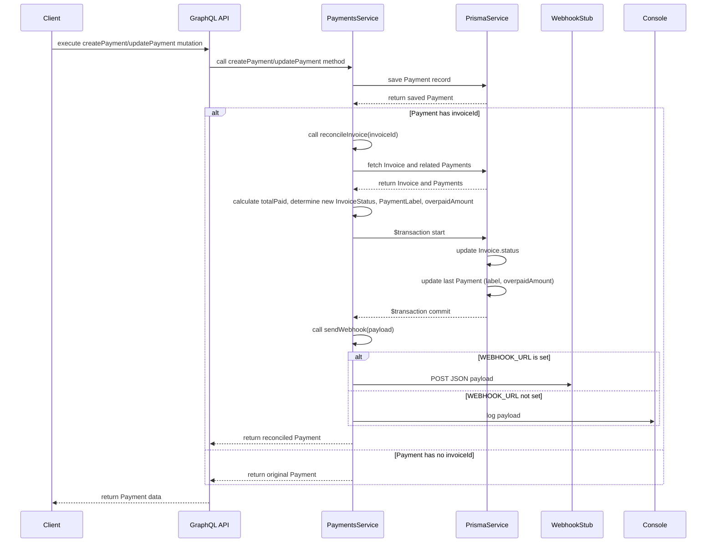

# ADR-04: Payment-Invoice Reconciliation Logic

**Date**: 2024-05-22

**Status**: Proposed

## Context

We need a mechanism to automatically reconcile manually registered payments with their corresponding invoices. This involves updating the invoice status based on the total amount paid against the invoice amount and notifying external systems via webhooks.

Key requirements:
- Invoice status transitions: `UNPAID` → `PARTIAL` → `PAID`.
- Handling of overpayments: Invoice status becomes `PAID`, and the excess amount is stored.
- Atomicity: Invoice balance calculation and status updates must occur within a single database transaction to ensure data consistency.
- Notifications: A webhook should be sent upon payment registration or update, containing payment and invoice details.

## Decision

We will implement a `reconcileInvoice(invoiceId)` helper function within the `PaymentsService`. This function will be called after a payment is created or updated via the `createPayment` and `updatePayment` mutations.

### Reconciliation Logic Flow:

1.  **Trigger**: `createPayment` or `updatePayment` mutation successfully completes a database write for a `Payment` record that has an `invoiceId`.
2.  **Call `reconcileInvoice(invoiceId)`**.
3.  **Inside `reconcileInvoice(invoiceId)`**:
    a.  Fetch the specified `Invoice` and all its associated `Payment` records.
    b.  Calculate the `totalPaidAmount` by summing the `amount` of all associated payments.
    c.  Compare `totalPaidAmount` with `invoice.amount`:
        *   If `totalPaidAmount == invoice.amount`:
            *   New `invoice.status` = `PAID`.
            *   The latest `payment.label` = `NORMAL`.
            *   `payment.overpaidAmount` = `null`.
        *   If `totalPaidAmount > invoice.amount`:
            *   New `invoice.status` = `PAID` (as per AC-3, `OVERPAY` is not a distinct invoice status here but a payment label).
            *   The latest `payment.label` = `OVERPAY`.
            *   `payment.overpaidAmount` = `totalPaidAmount - invoice.amount`.
        *   If `0 < totalPaidAmount < invoice.amount`:
            *   New `invoice.status` = `PARTIAL`.
            *   The latest `payment.label` = `PARTIAL`.
            *   `payment.overpaidAmount` = `null`.
        *   If `totalPaidAmount == 0` (e.g., all payments deleted or initial state):
            *   New `invoice.status` = `UNPAID`.
            *   The latest `payment.label` = `NORMAL` (or could be nullified if no payments exist).
            *   `payment.overpaidAmount` = `null`.
    d.  **Transaction**: Update the `Invoice` record (status) and the *last* `Payment` record (label, overpaidAmount) within a single Prisma transaction (`prisma.$transaction([...])`).
4.  **Webhook Notification (after reconciliation)**:
    a.  A helper function `sendWebhook(payload)` will be called.
    b.  If `process.env.WEBHOOK_URL` is set, it sends a POST request with JSON: `{ type: "payment", invoiceId, paymentId, status (of invoice) }`.
    c.  If `WEBHOOK_URL` is not set, `console.info` logs the payload.

### Data Model Changes (`prisma/schema.prisma`):

*   **`Payment` model**:
    *   Add `label PaymentLabel` (Enum: `NORMAL`, `PARTIAL`, `OVERPAY`).
    *   Add `overpaidAmount Decimal?` (to store the excess amount in case of overpayment).
*   **`InvoiceStatus` enum**:
    *   Ensure `OVERPAY` is added if it is meant to be a distinct status for invoices. (Ticket AC-1 implies `UNPAID -> PARTIAL -> PAID`, with `OVERPAY` as a payment characteristic rather than a distinct invoice status, which is reflected in the logic above where invoice status becomes `PAID` for overpayments).

### Visual Flow:

## Consequences

**Positive**:
- Automated invoice status management based on payments.
- Clear tracking of partial and overpayments.
- Consistency ensured by using database transactions.
- Extensibility for future webhook integrations.

**Negative/Risks**:
- The logic for updating the `label` and `overpaidAmount` currently targets the *last* payment chronologically associated with the invoice. If multiple payments are made rapidly or out of order, or if historical payments are modified in a way that changes the overall sum, this might lead to the label on an older payment not accurately reflecting the final state of a specific payment event. However, for typical workflows where a new payment triggers reconciliation, this is generally acceptable.
- If `WEBHOOK_URL` is unavailable, notifications are only logged. No retry mechanism is implemented in v1.
- The `Invoice.amount` is `Float` in the schema, while `Payment.amount` is `Decimal`. Comparisons and arithmetic operations need to be handled carefully, ideally by consistently using `Decimal` for calculations within the service.

## Alternatives Considered

1.  **External Reconciliation Service**: A separate microservice could listen to payment events and handle reconciliation. This adds complexity (deployment, communication) not justified for the current scale.
2.  **Database Triggers**: Using database triggers to update statuses. This can make business logic harder to test and maintain within the application layer.

--- 