# Data Models and API

## ER Diagram (Conceptual)

```mermaid
erDiagram
    USER {
        int id PK
        string username
        bool isAdmin
    }

    ACCOUNT {
        int id PK
        string code
        string name
        AccountCategory category
    }

    BUDGET {
        int id PK
        int accountId FK
        int fiscalYear
        Decimal amountPlanned
        DateTime createdAt
    }

    ATTACHMENT {
        int id PK
        string s3Key
        string title
        Decimal amount
        DateTime createdAt
        int uploaderId FK
        int expenseRequestId FK
    }

    JOURNAL_ENTRY {
        int id PK
        DateTime datetime
        string description
        int createdById FK
        int invoiceId FK
    }

    JOURNAL_LINE {
        int id PK
        int entryId FK
        int accountId FK
        Decimal debit
        Decimal credit
    }

    EXPENSE_REQUEST {
        int id PK
        RequestState state
        Decimal amount
        DateTime createdAt
        int attachmentId FK
        int requesterId FK
        int approverId FK
        DateTime approvedAt
    }

    INVOICE {
        int id PK
        string invoiceNo
        string partnerName
        float amount
        InvoiceStatus status
        string pdfKey
        DateTime createdAt
        int createdById FK
        DateTime dueDate
        string description
        int journalEntryId FK
        DateTime updatedAt
    }

    PAYMENT {
        int id PK
        DateTime paidAt
        Decimal amount
        PaymentLabel label
        Decimal overpaidAmount
        int invoiceId FK
        PaymentDirection direction
        PaymentMethod method
        int expenseRequestId FK
        DateTime createdAt
        DateTime updatedAt
    }

    PAYMENT_ATTACHMENT {
        int paymentId PK_FK
        int attachmentId PK_FK
    }

    USER ||--o{ ATTACHMENT : "uploads"
    USER ||--o{ JOURNAL_ENTRY : "creates"
    USER ||--o{ EXPENSE_REQUEST : "requests"
    USER ||--o{ EXPENSE_REQUEST : "approves"
    USER ||--o{ INVOICE : "creates"

    ACCOUNT ||--o{ JOURNAL_LINE : "has"
    ACCOUNT ||--o{ BUDGET : "has"

    JOURNAL_ENTRY }|--o{ JOURNAL_LINE : "contains"
    JOURNAL_ENTRY }o--|| INVOICE : "relates to"

    ATTACHMENT }o--|| EXPENSE_REQUEST : "is for"

    EXPENSE_REQUEST ||--o{ PAYMENT : "funded by"

    INVOICE ||--o{ PAYMENT : "settled by"

    PAYMENT ||--|{ PAYMENT_ATTACHMENT : "has"
    ATTACHMENT ||--|{ PAYMENT_ATTACHMENT : "is part of"

```



## GraphQL API

### Types

```graphql
# ... (other types)

type Budget {
  id: Int!
  accountId: Int!
  fiscalYear: Int!
  amountPlanned: Float! # Represented as Decimal in backend, Float in GraphQL
  createdAt: DateTime!
  account: Account # Optional: if you want to resolve the account details
}

input BudgetInput {
  accountId: Int!
  fiscalYear: Int!
  amountPlanned: Float!
}
```

### Queries

```graphql
# Returns all budgets for a specified fiscal year.
budgets(fiscalYear: Int!): [Budget!]!
```

### Mutations

```graphql
# Creates or updates a budget for a given account and fiscal year.
# If a budget already exists for the accountId and fiscalYear combination, it's updated (upsert).
# Otherwise, a new budget record is created.
setBudget(input: BudgetInput!): Budget!
``` 